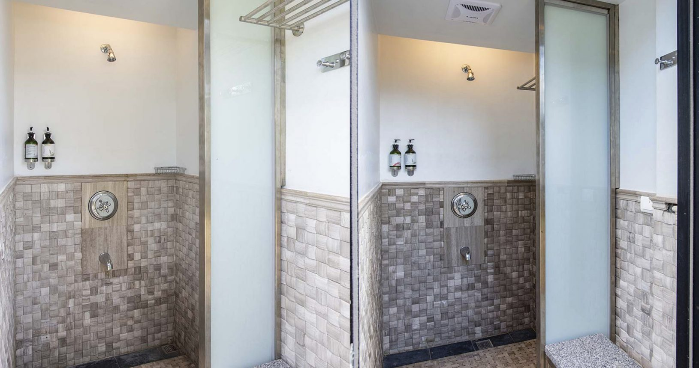

# 露營設施

## 露友食堂

可以嚐到深受露友喜愛的古巴三明治及多種豐富澎湃的餐食。另午後這裡的主流不是喝下午茶，是吃各款冰品，全台首創「冰品共和國」也在這裡登場讓你吃撐撐啊! 來這裡享受美食伴無敵海景，這樣才對墾丁味，更對你的味!

## 公共衛浴

園區內於各區域共設有五座盥洗設備，讓露友可以自由選擇最近的盥洗間。沙灘玩耍，各式水上活動後最想投奔處。備有冷熱水、沐浴乳、洗髮乳，貼心到連椅子都在內，沖去一身疲憊後下一站~陽台上吹風。

## 炊事屋

整個營區內設有三座炊事屋，內有冰箱、多組瓦斯爐、飲水機，居然還有製冰機，這是營主怕大家颳風下雨時還在外奮鬥煮飯糊口的貼心設計，同時也能減輕露友的裝備，使您露營時更加輕鬆。

## 生態活動教室

備有近百個座位、大型投影布幕，面對巴士海峽的獨特海景，在海面的波光瀲灩將腦海裡的想像延伸，激盪出絕佳的創意花火。

## 黑潮市服務中心

這裡隨時為您提供旅遊諮詢，協助您達成上山下海的願望。更特別的是還有一個專為露友而設的八角小區，來杯古巴風特調，夜晚微醺神遊哈瓦那。

