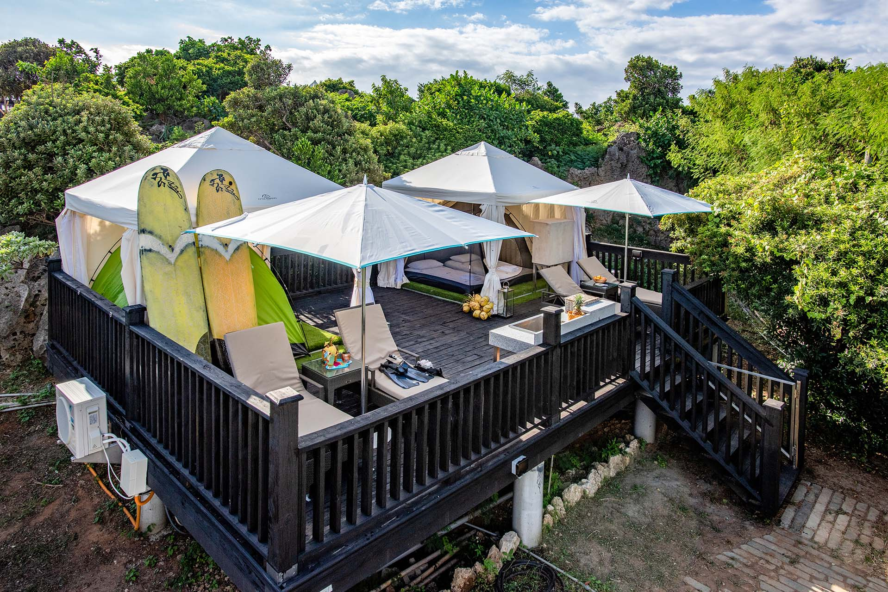

# `Villa 4人D型 (4人兩帳)`

## 

---

### 入住須知

- 若需加人請事先告知，每房限加兩位大人。
- 加人需另外依年紀收費。4~11 歲收費$1,200 元；12 歲(含)以上收費$1,500 元；3 歲以下一位不收費。
- 農曆春節期間，大人收費為$2,000 元。
- 為確保住客安全及設施完備，本莊園營帳區及客廳區頂棚、陽傘等設備，本莊園有權視風力情況予以解除不予提供。另因應颱風前後，營區設備之解除及組裝，本莊園有權請預訂之客人提前或延期，客人不得異議。
- 本莊園除導盲犬外，暫不接待寵物。
- 天候預測如入住日風速超過 30km 以上，建議客人可做延期。

---

### 費用包含

- 贈晨光早餐 & 精緻晚餐
- 4 人兩帳 帳位平台尺寸 920 x 630cm
- 提供露營所需帳篷、寢具及盥洗用具

---

Markdown code blocks are supported with Syntax highlighting.

    ```jsx title="src/components/HelloDocusaurus.js"
    function HelloDocusaurus() {
        return (
            <h1>Hello, Docusaurus!</h1>
        )
    }
    ```

```jsx title="src/components/HelloDocusaurus.js"
function HelloDocusaurus() {
  return <h1>Hello, Docusaurus!</h1>;
}
```

## Admonitions

Docusaurus has a special syntax to create admonitions and callouts:

    :::tip My tip

    Use this awesome feature option

    :::

    :::danger Take care

    This action is dangerous

    :::

:::tip My tip

Use this awesome feature option

:::

:::danger Take care

This action is dangerous

:::

## MDX and React Components

[MDX](https://mdxjs.com/) can make your documentation more **interactive** and allows using any **React components inside Markdown**:

```jsx
export const Highlight = ({children, color}) => (
  <span
    style={{
      backgroundColor: color,
      borderRadius: '20px',
      color: '#fff',
      padding: '10px',
      cursor: 'pointer',
    }}
    onClick={() => {
      alert(`You clicked the color ${color} with label ${children}`)
    }}>
    {children}
  </span>
);

This is <Highlight color="#25c2a0">Docusaurus green</Highlight> !

This is <Highlight color="#1877F2">Facebook blue</Highlight> !
```

export const Highlight = ({ children, color }) => (
  <span
    style={{
      backgroundColor: color,
      borderRadius: "20px",
      color: "#fff",
      padding: "10px",
      cursor: "pointer",
    }}
    onClick={() => {
      alert(`You clicked the color ${color} with label ${children}`);
    }}
  >
    {children}
  </span>
);

This is <Highlight color="#25c2a0">Docusaurus green</Highlight> !

This is <Highlight color="#1877F2">Facebook blue</Highlight> !
